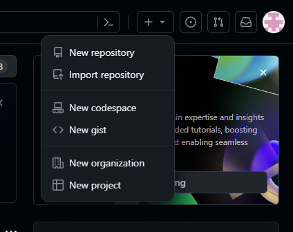

## Создание проекта

* ### На главной странице нажмите кнопку **"Create new..."**

* ### Во вкладке выберите пункт **"New repository"**

* ### Введите Имя репозитория

* ### Описание (не обязательно)

* ### Выбираете тип репозитория между **Public** (*Любой в интернете может просматривать данный репозиторий, вы выбираете кому предоставить доступ к изменению*) и **Private** (*Вы выбираете кто может просматривать и делать изменения*). По умолчанию выбран **публичный** тип

#### [Вернуться на главную](readme.md) | [Назад](registration.md) | [Следующая страница](gitinit.md)